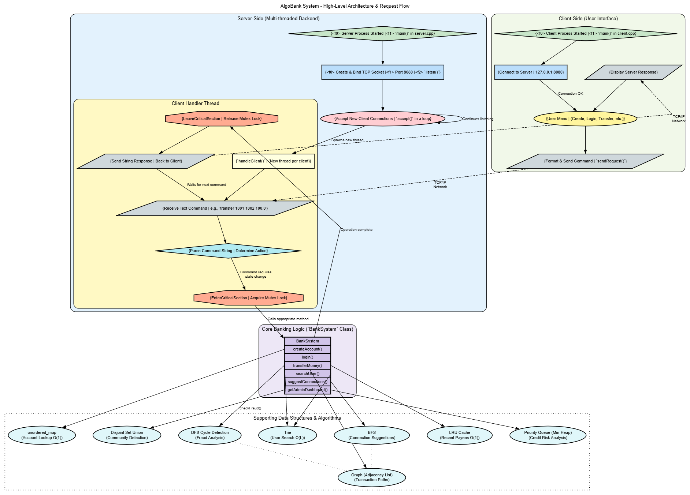

# AlgoBank: A High-Performance, Multi-Threaded Banking System in C++


## Executive Summary

AlgoBank is an exemplary C++ project that demonstrates a strong, practical command of fundamental computer science principles. This project implements a **multi-threaded, client-server architecture** to simulate a real-world banking application. It showcases not only a deep understanding of various data structures and algorithms but also a thoughtful approach to system design, scalability, and modularity.

The core strength of this project lies in its **justification of technology**. Each feature is powered by a deliberately chosen data structure, and the rationale behind each choice is sound, reflecting an ability to map theoretical knowledge to practical problem-solving. The separation of the core banking logic from the network-facing server and the user-facing client demonstrates a mature understanding of software engineering principles like **separation of concerns**.

-----
## 🧠 Project Evolution

This is a complete rewrite of the original [AlgoBank](https://github.com/AkshayTiwari27/AlgoBank.git), which was a CLI-based single-user system.

Key improvements:
- ✅ Introduced TCP networking for multi-device communication
- ✅ Added multithreading to handle concurrent client requests
- ✅ Implemented server-side concurrency safety with mutexes
- ✅ Added advanced DSA features like Trie, DFS, DSU, etc.

-----

## System Architecture: A Scalable Client-Server Model

The application is architected as a robust client-server model, which is the industry standard for building scalable and distributed systems.
<p align="center">
  
  <br/>
  <em>A high-level overview of the client-server interaction and the multi-threaded server design.</em>
</p>


### Architectural Breakdown:

  * **`server` (The Backend):** This is the authoritative core of the system.

      * **Concurrency:** The server is multi-threaded, spawning a new thread for each client connection. This allows it to handle multiple clients simultaneously, which is essential for any real-world service.
      * **Synchronization:** Crucially, access to the shared `BankSystem` object is protected by a `CRITICAL_SECTION` (mutex). This is a vital demonstration of thread safety, preventing race conditions when multiple clients attempt to perform transactions or modify data concurrently.
      * **Logic Core:** It houses the `BankSystem` class, which encapsulates all business logic and data management.

  * **`client` (The Frontend):** This is a lightweight, terminal-based user interface.

      * **Thin Client:** It contains no banking logic. Its sole responsibilities are to accept user input, format it into commands, send them to the server over a TCP socket, and display the server's response. This design makes the client easy to maintain and allows for different types of clients (e.g., a web or GUI client) to be developed in the future.

  * **Communication Protocol:** Communication occurs over TCP sockets using a simple, text-based protocol (e.g., `create <pin> <name>`). The server processes these commands and returns a string response.

-----

## Feature-Driven DSA Implementation: A Technical Analysis

The selection of data structures is purposeful and optimized for the task at hand, demonstrating a strong connection between theory and application.

| Feature | Data Structure / Algorithm | Technical Rationale & Analysis |
| :--- | :--- | :--- |
| **Concurrent Account Access** | `unordered_map`, Mutex | Using a hash map for account lookup provides O(1) average complexity. The use of a mutex to serialize access ensures that operations like transfers are **atomic**, which is a correct and fundamental approach to concurrency control. |
| **Financial Fraud Detection** | **DFS Cycle Detection** on Graph | A cycle in a transaction graph (e.g., A -\> B -\> C -\> A) is a classic pattern for fraud. Using DFS to detect cycles after each transfer is an elegant and computationally efficient way to flag suspicious activity in real-time. |
| **High-Speed User Search** | **Trie (Prefix Tree)** | For a feature like user search or autocomplete, a Trie is the optimal choice. It allows for prefix-based searches in O(L) time (where L is query length), which is significantly faster than iterating through all users. |
| **Credit Risk Analysis** | **`priority_queue` (Min-Heap)** | The admin dashboard needs to quickly identify the riskiest clients. A Min-Heap allows for efficiently querying the top `k` lowest-scoring users in O(k log n) time, which is far more efficient than sorting all users on each view. |
| **Personalized User Caching** | **LRU (Least Recently Used) Cache** | Caching recent payees improves performance and user experience. An LRU cache, implemented with a doubly-linked list and a hash map, is the classic solution, providing O(1) complexity for both `put` and `get` operations. |
| **Social Network Analysis** | **Breadth-First Search (BFS)** | To suggest "people you may know," the system finds users within a few "hops" in the transaction graph. BFS is the textbook algorithm for finding the shortest path in an unweighted graph, making it a perfect fit. |
| **Transaction Community Detection** | **Disjoint Set Union (DSU)** | The admin dashboard features an analysis of transaction "clusters." A DSU data structure is a highly efficient way to partition users into disjoint sets based on their transaction history, effectively identifying connected components. |

-----

## How to Build and Run

### Prerequisites

  * A C++11 (or newer) compatible compiler (g++, Clang, etc.)
  * `make` (recommended)
  * **Windows:** MinGW or Visual Studio C++ Build Tools
  * **Linux/macOS:** `build-essential` or Xcode Command Line Tools

### Compilation (Makefile Recommended)

Navigate to the project root and execute `make`:

```bash
make
```

This will produce two executables: `server` and `client`.

### Execution

1.  **Start the Server:** Open a terminal and run the server. It will begin listening for connections on port 8080.

    ```bash
    ./server
    # On Windows: .\server.exe
    ```

2.  **Start the Client:** Open a **second terminal** and run the client to connect to the server. You can run multiple instances of the client.

    ```bash
    ./client
    # On Windows: .\client.exe
    ```

-----

## Usage Demonstration

The system is initialized with five dummy accounts to allow for immediate testing.

  * **Account ID:** 1001, **Name:** Alice
  * **Account ID:** 1002, **Name:** Bob
  * **Account ID:** 1003, **Name:** Charlie
  * **Account ID:** 1004, **Name:** David
  * **Account ID:** 1005, **Name:** Eve

Here is a sample walkthrough of the application:

**1. Create a new account:**

```
===================================
=== Welcome to AlgoBank System ===
===================================
1. Login
2. Create Account
3. Admin Dashboard
4. Exit
Enter your choice: 2

--- Create New Account ---
Enter your full name: John Doe
Create a 4-digit PIN: 9876

[SERVER RESPONSE]
Account created successfully for John Doe. Your Account ID is: 1006
```

**2. Log in with the new account:**

```
Enter your choice: 1

--- Login ---
Enter Account ID: 1006
Enter PIN: 9876

--- Welcome John Doe (Account #1006) ---
Balance: $1000.00
...
```

**3. Transfer money and see a fraud alert:**
(First, transfer $100 from John (1006) to Alice (1001). Then, log in as Alice and transfer money back to John to create a cycle.)

```
--- Welcome John Doe (Account #1006) ---
Balance: $1000.00
...
Enter your choice: 1
Enter recipient Account ID: 1001
Enter amount: $100

[SERVER RESPONSE]
Transfer successful from 1006 to 1001.
```

*(Now, in another client, log in as Alice and send money back to John to create a cycle)*

```
--- Welcome Alice (Account #1001) ---
Balance: $1100.00
...
Enter your choice: 1
Enter recipient Account ID: 1006
Enter amount: $50

[SERVER RESPONSE]
Transfer successful from 1001 to 1006.

!!!!!!!!!!!!!!!!!!!!!!!!!!!!!!
!!! FRAUD ALERT: A potential cycle of transactions has been detected starting from account 1001.
!!!!!!!!!!!!!!!!!!!!!!!!!!!!!!
```

**4. Search for a user with the Trie:**

```
--- Welcome John Doe (Account #1006) ---
...
Enter your choice: 3
Enter name prefix to search: Dav

[SERVER RESPONSE]
--- Search Results (Trie) ---
  - Name: David, Account ID: 1004
```

-----

## Future Enhancements

This project provides a strong foundation. To evolve it into a production-grade system, the following areas could be addressed:

  * **Database Integration:** The current system state is ephemeral. Integrating a database like **SQLite** or **PostgreSQL** would provide data persistence.
  * **Fine-Grained Concurrency:** A single global mutex can be a bottleneck. A more advanced approach would be to implement **fine-grained locking** (e.g., a mutex per account) to increase throughput, while carefully managing potential deadlocks.
  * **API-Driven Design:** The text-based protocol could be evolved into a standard **RESTful API** using a C++ web framework (like `oat++` or `Crow`), decoupling the backend from a specific client implementation.
  * **Security Hardening:** Implementing **TLS/SSL encryption** for all client-server traffic and performing rigorous server-side input sanitization are critical next steps for security.
  * **Robust Testing:** Building out a suite of **unit and integration tests** (e.g., with Google Test) and setting up a **CI/CD pipeline** would automate testing and ensure code quality.
